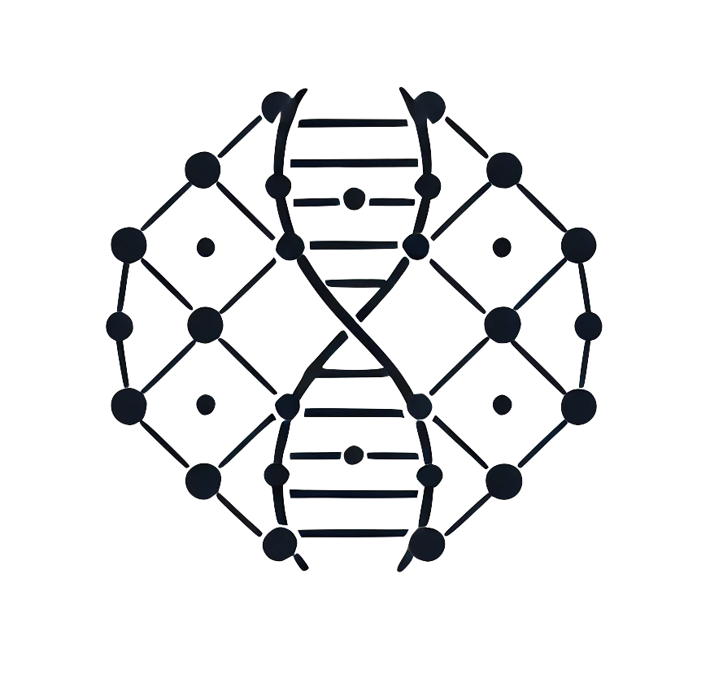

[](https://hex.pm/packages/ontogen)
[](https://hexdocs.pm/ontogen/)
[](https://github.com/ontogen/ontogen/blob/main/LICENSE.md)

[](https://github.com/ontogen/ontogen/actions/workflows/elixir-build-and-test.yml)
[](https://github.com/ontogen/ontogen/actions/workflows/elixir-quality-checks.yml)


<br />
<div align="center">
  <a href="https://ontogen.io">
    
  </a>

  <h2 align="center">Ontogen</h2>

  <p align="center">
    A version control system for RDF datasets
    <br />
    <a href="https://ontogen.io"><strong>Explore the docs »</strong></a>
    <br />
    <br />
    <a href="https://github.com/ontogen/ontogen/blob/main/CHANGELOG.md">Changelog</a>
    ·
    <a href="https://github.com/ontogen/ontogen/issues">Report Bug</a>
    ·
    <a href="https://github.com/ontogen/ontogen/issues">Request Feature</a>
    ·
    <a href="https://github.com/ontogen/ontogen/discussions">Discussions</a>
  </p>
</div>


## About the Project

Ontogen is a Data-Control-Management (DCM) solution specifically designed for RDF dataset in SPARQL triple stores. It provides version control capabilities similar to Git, but tailored for RDF datasets. Ontogen stores the version history of statements in a dedicated named graph within the RDF dataset completely separated from the actual data, much like the `.git` directory in a Git repository.

Key features of Ontogen include:

- Provenance metadata generation for changes in the triple store
- Incorporation of speech act utterances for RDF statements
- Integration with PROV and DCAT models

Ontogen takes a holistic approach to RDF data versioning by considering not just the syntactical and semantical levels, but also the pragmatic layer of the semiotic spectrum.

> **Note for end users:** If you're looking to use Ontogen as a command-line tool, please check out the [Ontogen CLI](https://github.com/ontogen/ontogen_cli) repository. The CLI provides a user-friendly interface for Ontogen functionality.


## Getting Started

### Prerequisites

To use Ontogen, you'll need:

- Elixir v1.15+ & Erlang/OTP v23+
- A SPARQL-compatible triple store (currently only Fuseki and Oxigraph are officially supported)

### Installation

Add Ontogen to your list of dependencies in `mix.exs`:

```elixir
def deps do
  [
    {:ontogen, "~> 0.1"}
  ]
end
```

Then run:

```
$ mix deps.get
```


## Usage

Here's a basic example of how to use Ontogen with its CLI:

```sh
$ mkdir example
$ cd example

$ og init --adapter Oxigraph
Initialized empty Ontogen repository in /Users/JohnDoe/example

$ og setup
Set up Ontogen repository

$ og add data.ttl

$ og commit --message "Initial commit"
[(root-commit) 6fc09c94768204983d0409d28e0796ec3f17cef46e57c5cb1248424d3922040d] Initial commit
 3 insertions, 0 deletions, 0 overwrites

$ og log --changes
ec8108e3f4 - Initial commit (just now) <John Doe john.doe@example.com>
   <http://www.example.org/employee38>
 +     <http://www.example.org/familyName> "Smith" ;
 +     <http://www.example.org/firstName> "John" ;
 +     <http://www.example.org/jobTitle> "Assistant Designer" .
```

_For more examples, please refer to the [User Guide](https://ontogen.io/user-guide/)_


## Roadmap

- [ ] Support for multiple graphs in an RDF dataset
- [ ] Implement branching and merging capabilities
- [ ] Support for more triple stores
- [ ] ... 

See the [open issues](https://github.com/ontogen/ontogen/issues) for a full list of proposed features (and known issues).


## Contact

Marcel Otto - [@marcelotto@mastodon.social](https://mastodon.social/@marcelotto) - [@MarcelOttoDE](https://twitter.com/MarcelOttoDE) - marcelotto@gmx.de


## Acknowledgments

<table style="border: 0;">  
<tr>  
<td><a href="https://nlnet.nl/"></a></td>  
<td><a href="https://nlnet.nl/assure" ></a></td>  
<td><a href="https://www.jetbrains.com/?from=RDF.ex"></a></td>  
</tr>  
</table>  
  
This project is funded through [NGI Assure](https://nlnet.nl/assure), a fund established by [NLnet](https://nlnet.nl/) with financial support from the European Commission's [Next Generation Internet](https://ngi.eu/) program.
  
[JetBrains](https://www.jetbrains.com/?from=RDF.ex) supports the project with complimentary access to its development environments.


## License

Distributed under the MIT License. See `LICENSE.md` for more information.
